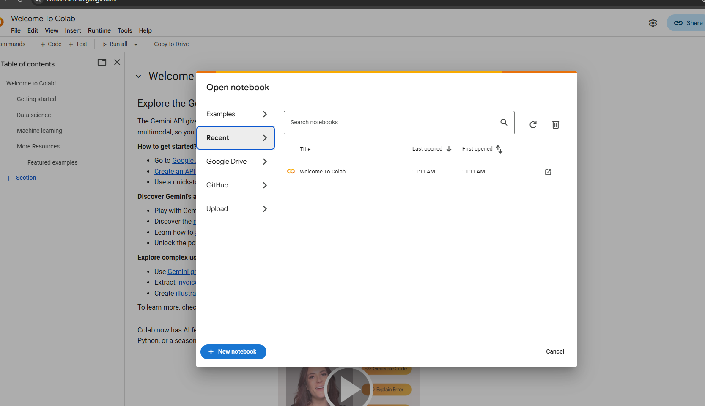

# colab-wheat-coccinellid-Detection

Open the paper published on https://www.sciencedirect.com/science/article/pii/S2352340924005523 and scroll down until you see the "Data Availability" section.
Click on the Wheat_Coccinellid (Original data) to download. Then, use the colab-wheat-coccinellid-detection-project ipynb file for the next steps.

Steps to access Colab

i) create google account

ii) Access the Google colab page (https://colab.research.google.com/)

You should be able to see the below screen. . Click on the "New notebook button".

As soon as you create a new notebook, you will see notebook where you can start coding.